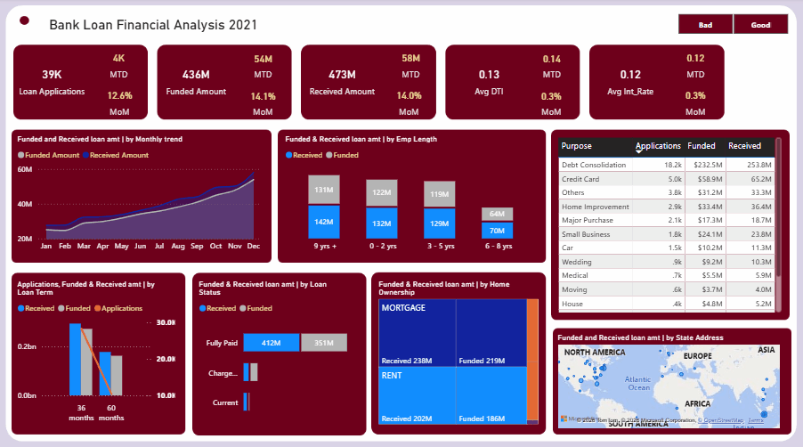
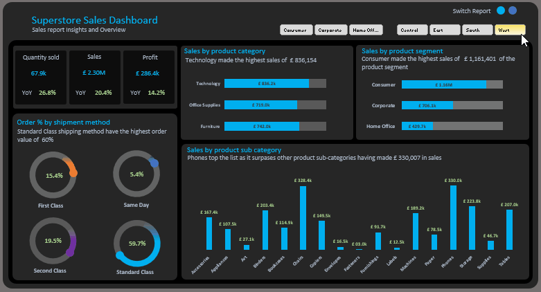

<h1 align="center">Hi, I'm Alabi Ibrahim</h1>

  <b>Turning data into insights, and insights into impact.</b> 
  <a href="mailto:alabi0147@gmail.com">Email</a> |
  <a href="https://www.linkedin.com/in/alabi-ibrahim-73332b236">LinkedIn</a> 

---

## About Me

I help startup and growth teams turn messy, scattered data into clear, decision-ready dashboards that reduce costs, improve performance, and uncover growth opportunities.

Over the last few years, I’ve supported teams at Excelerate, Lloyd’s Banking Group, and Accenture - building reporting systems, analyzing customer behavior, and delivering insights that leaders actually use.

What I help teams do:

- Eliminate manual Excel reporting
- Build Power BI & Tableau dashboards for leadership
- Understand customer behavior & churn
- Track revenue, costs, and product performance
- Turn raw data into actionable business decisions

If you’re a founder, operations lead, or growth manager who wants better visibility into your business, send me a message - I’ll be happy to review your current reporting setup and suggest improvements.

---

## Technical Skills 
- **SQL** (SQL Server, PostgreSQL)
- **Excel** (Functions & Formulas, Power Query, VBA)
- **Power BI** (DAX, Visualization)
- **Tableau** (Visualization, Calculated Fields)

## Soft Skills
- **Problem Solving**
- **Critical Thinking**
- **Effective Communication**
- **Team Collaboration**
- **Curiosity**

---

## 🎓 Certifications

- **Microsoft Certified: Power BI Data Analyst Associate**
- **Google Data Analytics Professional Certificate**
- **Excelerate Data Analytics Internship Program**
- **Accenture Job Simulation**

---

## Featured Projects

Here are a few selected projects that showcase my skills in real-world data analysis:

| Project | Description | Tools |
|--------|-------------|-------|
| [Business Intelligence Report](https://alabiibrahim.github.io/Business-Sales-Intelligence-Report/) | 14.54m in total sales which indicate YoY growth of 14.58%. | Excel- DAX, Power Query |
| [Pizza Sales Report](https://alabiibrahim.github.io/Pizza-sales-report/) | Interactive Power BI dashboard analyzing pizza sales KPIs, best selling and profitability. | Power BI, SQL |
| [Industry Database Design](https://alabiibrahim.github.io/Industry-Database-Design---SQL/) | This project is a complete SQL Server based relational database designed to handle the core backend requirements of a modern digital platform. | SQL |
| [Superstore Sales Report](https://alabiibrahim.github.io/Superstore-Sales-Report/) | Increase sales by 20% and YoY profit by 14.2%. | Excel- Power Query |
| [Road Accident Report](https://alabiibrahim.github.io/Road-accident-report/) | Reduce road accidents rate by 13% | Power BI, SQL Server |
| [Sales Call Marketing Center](https://alabiibrahim.github.io/Sales-Call-Marketing-Center/) | Call center data is analyzed to track and evaluate call center agent performance. | Excel |
| [Bank Customer Churn Analysis](https://alabiibrahim.github.io/Bank-Churn-Analysis/) | Reduced churn rate by 5 - 8% within 12 months | Excel- Power Query, DAX |

---

<!--Section 2: List 3-4 key projects-->

*A glimpse of some of the projects I've been working on.*

**Business Intelligence Report - Identifying $1.62m in high value growth | Excel.**

I built this interactive dashboard to pinpoint revenue drivers across 300 customers and 50 product lines. Featuring granular weekly distribution and quarterly YoY comparisons, it provides the executive clarity needed to scale the £48.5k average revenue per customer through data-backed inventory and marketing shifts.

[Read More](https://alabiibrahim.github.io/Business-Sales-Intelligence-Report/)

**Plant Co. Performance - $13m revenue tracked across 6 continents | Power BI.**

Delivered actionable insights on profitability, product segmentation, and geographic performance using advanced visualizations. Achieved a 39.62% gross profit margin and identified a $512K YoY dip with month-by-month breakdowns. Built with precision to support executive decision-making and strategic planning.

[Read More](https://alabiibrahim.github.io/Plant-Co.-Global-Performance/)

**Bank Financial Loan Intelligence System - Analyzes over $435m in loan | Excel, Power BI.**

Developed a comprehensive Bank Loan Intelligence System that analyzes over $435M in loan data to monitor portfolio health and borrower risk. By visualizing key metrics like a 13.3% average DTI and identifying Debt Consolidation as the primary loan driver, this project provides actionable insights to improve lending strategies and maintain a 86.2% Good Loan rate.

[Read More](https://alabiibrahim.github.io/Financial-Loan-Analysis-2021/)

**Industry Standard Database Design - Scalability, Security, Maintainability | SQL (Server).**

This project is a complete SQL Server based relational database designed to handle the core backend requirements of a modern digital platform. This database follows industry best practices for security, scalability and maintainability that companies like Google uses.

[Read More](https://alabiibrahim.github.io/Industry-Database-Design---SQL/)

**Sales Marketing Call Center.**

Unfortunately, there weren’t enough lifeboats for everyone onboard, resulting in the death of 1502 out of 2224 passengers and crew. 

[Readmore](https://alabiibrahim.github.io/Sales-Call-Marketing-Center/)

**Superstore Sales Report - Increase sales by 20% and YoY profit by 14.2% | Excel**

To identify top-performing product lines, customer segments, and shipping methods in order to maximize profit growth and streamline sales strategy. 

[Read More](https://alabiibrahim.github.io/Superstore-Sales-Report/)

**Bank Churn Analysis - Reduced churn rate by 5 - 8% within 12 months| Excel (Server).**

This report analyzes customer churn patterns to identify key drivers influencing attrition across demographics, geography, product usage, and satisfaction levels. The goal is to uncover actionable insights that help reduce customer churn, improve retention, and maximize customer lifetime value.

[ReadMore](https://alabiibrahim.github.io/Bank-Churn-Analysis/)

<a href="17 How to Present Data to Executives by Anietie Etuk.pdf">Download the Report here (pdf file)</a>

## CONTACT DETAILS

*Let’s connect and see how we can make a difference together!*
<table>
  <tbody>
    <tr>
      <td>📧</td>
      <td><a href="mailto:alabi0147@gmail.com">alabi0147@gmail.com</a></td>
    </tr>
    <tr>
      <td>📞</td>
      <td>(234) 0902-7929-795</td>
    </tr>
    <tr>
      <td>📍</td>
      <td>Lagos, Nigeria</td>
    </tr>
    <tr>
      <td>⬇️</td>
      <td><a href="https://github.com/alabiibrahim/myportfolio/blob/main/Resume/Alabi%20Ibrahim.pdf">Resume</a></td>
    </tr>
    <tr>
      <td>🌐</td>
      <td><a href="https://www.linkedin.com/in/alabi-ibrahim-73332b236">LinkedIn</a></td>
    </tr>
  </tbody>
</table>

---

  <i>“Without data, you're just another person with an opinion.” — W. Edwards Deming</i>

